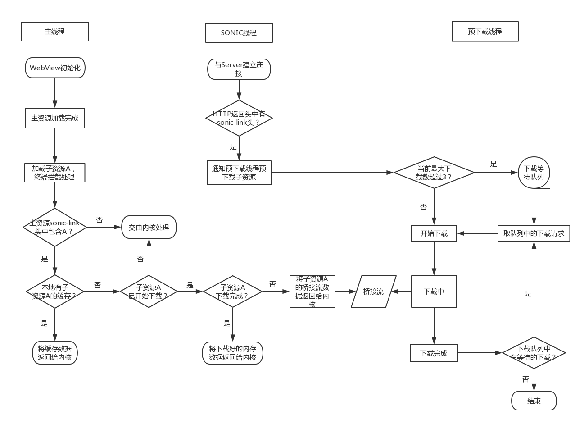

# Sonic 3.0 子资源预下载功能特性介绍

## 1 子资源预下载

VasSonic中子资源预下载功能的灵感就来源于Chrome中的\<link rel='preload'/>。
> \<link rel='preload'/>：\<link>元素的rel属性的属性值preload能够让你在你的HTML页面中\<head>元素内部书写一些声明式的资源获取请求，可以指明哪些资源是在页面加载完成后即刻需要的。对于这种即刻需要的资源，你可能希望在页面加载的生命周期的早期阶段就开始获取，在浏览器的主渲染机制介入前就进行预加载。这一机制使得资源可以更早的得到加载并可用，且更不易阻塞页面的初步渲染，进而提升性能。

### 1.1 子资源预下载开启方式
想要开启VasSonic 3.0中的子资源预下载功能，需要终端或者后台参与。在请求主资源时，由后台在Response Header中添加一个名为```sonic-link```的响应头部字段，这个字段的值指定了期望得到预下载的子资源，不同的子资源url之间由";"区分。可以预下载的子资源类型包括图片、css样式文件、js脚本文件等等。示例如下：

```http
sonic-link: http://test.js;http://test.css;http://test.jpg
```

除了后台返回```sonic-link```相应头，也可以通过终端指定```sonic-link```，方式如下：

```java
SonicSessionConfig.Builder sessionConfigBuilder = new SonicSessionConfig.Builder();
Map<String, String> headers = new HashMap<String, String>();
headers.put("sonic-link", "http://test.js;http://test.css;http://test.jpg");
sessionConfigBuilder.setCustomResponseHeaders(headers);
sessionConfigBuilder.build();
```

### 1.2 子资源预下载的流程说明
VasSonic检测到主资源响应头中的```sonic-link```字段时，子资源预下载模块就会开始工作，具体执行流程如下图：



1. 对```sonic-link```字段中的字资源进行下载是在单独的预下载线程中进行；  
2. 当内核请求的子资源url不在```sonic-link```头中时，VasSonic不做处理，完全抛给内核；  
3. 当内核请求的子资源url在```sonic-link```头中时，有以下四种情况： 
    - 如果对应的子资源有缓存且缓存不过期，则直接加载该缓存；
    - 如果对应的子资源没有缓存，且子资源下载处于排队状态，抛给内核处理（Sonic仍会完成该资源的下载并进行缓存）；
    - 如果对应的子资源没有缓存，且子资源正在下载，则将已下载的内存数据和未下载的网络流数据组成桥接流给内核；
    - 如果对应的子资源没有缓存，且子资源已下载完成，则将下载完成的子资源数据给内核。

### 1.3 子资源缓存相关
子资源完成预下载之后会在本地进行缓存，缓存规则如下：
1. 子资源数据和子资源响应头数据会分别进行缓存，子资源url的MD5作为子资源数据缓存文件名，子资源url的MD5.header作为子资源响应头缓存的文件名。
2. 子资源和子资源响应头的缓存数据都保存在```/sdcard/SonicResource/```目录下；
2. 子资源缓存的过期过期时间由```sonic-link```头中子资源url参数```max-age```唯一决定；
3. 一旦本地子资源缓存被恶意篡改，被篡改过的子资源不会通过VasSonic校验，该缓存会被删除；
4. 默认每隔24小时进行一次缓存检查，如果超过大小限制（默认60M，可设置），会进行一次缓存清理。

使用如下方式进行缓存相关设置：

```java
SonicConfig.Builder builder = new SonicConfig.Builder();

// 设置缓存校验方式为校验文件大小，默认为对文件内容进行Sha1校验
builder.setCacheVerifyWithSha1(false);

// 设置子资源缓存最大为100M，默认为60M
builder.setResourceCacheMaxSize(100 * 1024 * 1024);

// 设置缓存大小检查时间间隔为12小时，默认为24小时
builder.setCacheCheckTimeInterval(12 * 60 * 60 * 1000L);

builder.build();
```
