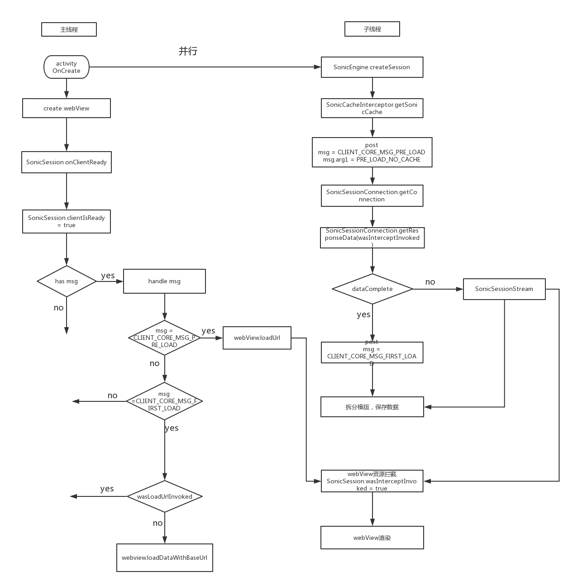
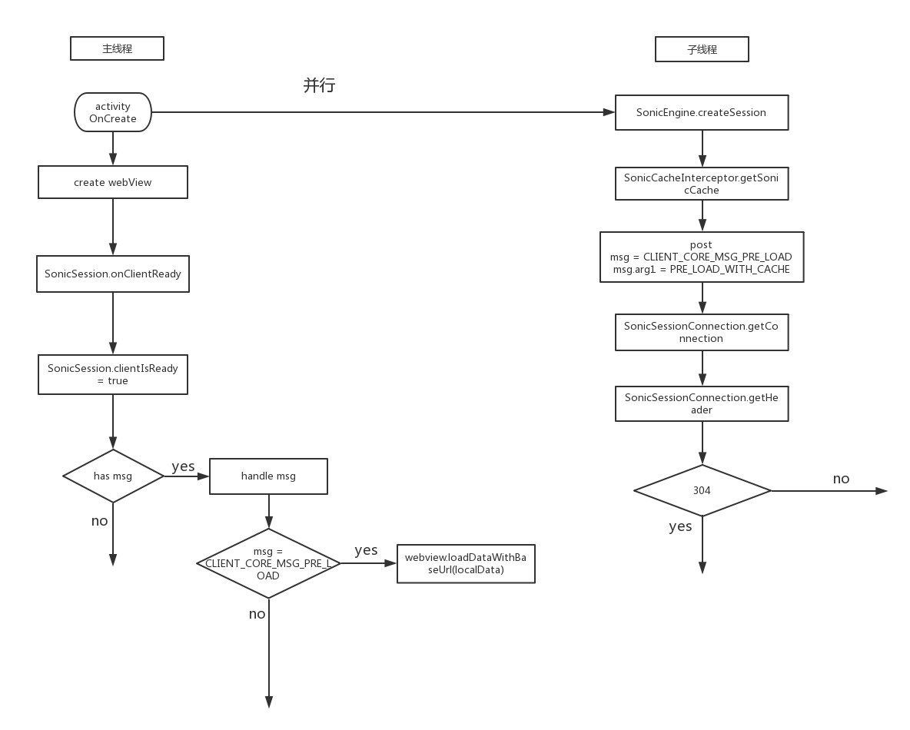
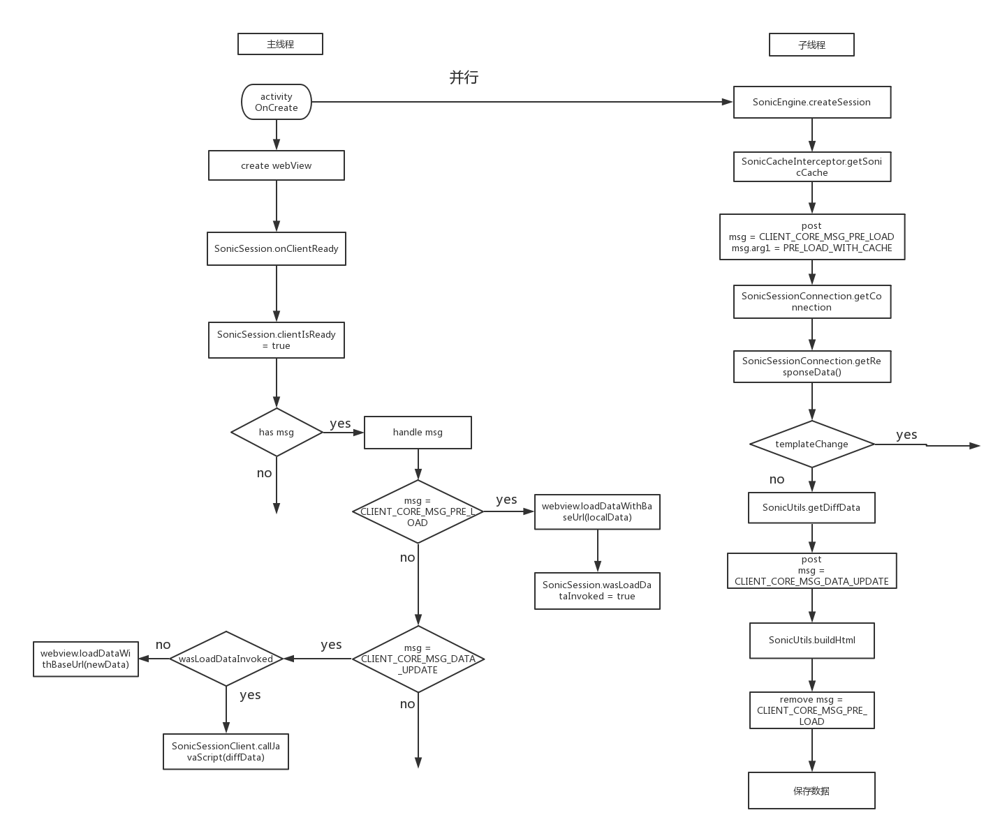
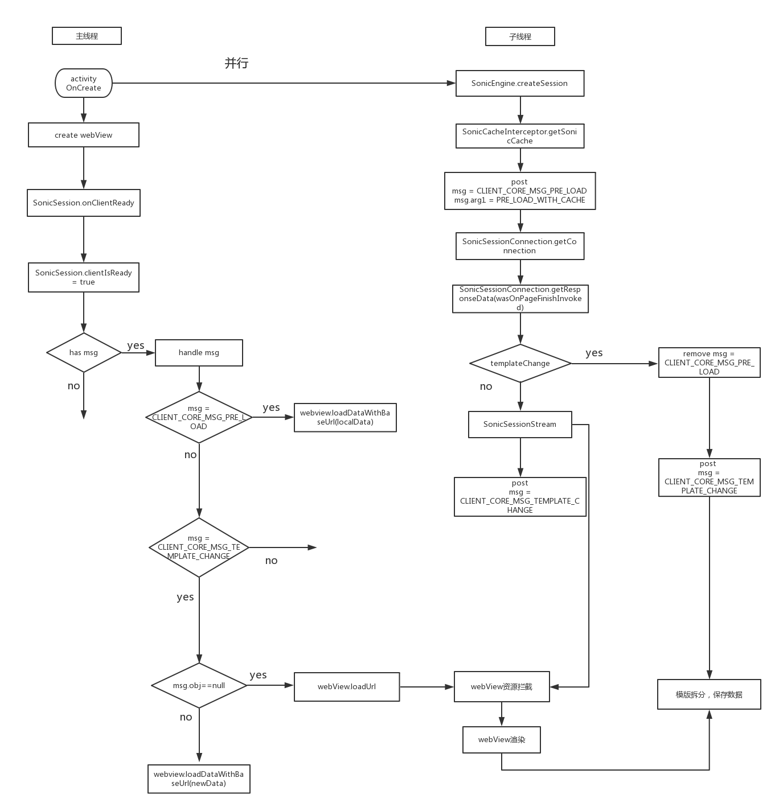

# Sonic Quick模式实现原理

---
根据本地是否有缓存数据可以将Quick模式下的sonic分为无缓存和有缓存模式。对于有缓存模式又可以分为完全缓存、局部刷新和全局刷新（也就是模版变更），下面就看下这几种模式的执行流程。

无论是哪种执行模式，核心的思想都是并行，即充分利用webview初始化的时间进行一些数据的处理(webview的初始化耗时还是挺多的)。在包含webview的activity启动时会一边进行webview的初始化逻辑，一边并行的执行sonic的逻辑。

## 一，无缓存模式

无缓存模式下的核心思想就是在webview初始化之前建立自己的网络连接，利用webview初始化的时间尽可能多的读取网络的数据，在webview需要数据的时候将自己从网络读取的数据交给webview处理。

代码的主要执行流程

这里主要有两条并行线，左边是webview的执行流程，右边是sonic的执行流程。Webview的执行流程比较简单，主要是进行webview的初始化，以及在初始化完之后调用SonicSession（这里的SonicSession对象是activity onCreate的时候通过SonicEngine创建的）的onClientReady方法，告知其webview已经init完毕。剩下的事情交给sonic那边处理。

右边这条sonic的执行流程线相对会复杂一些，首先，在activity create之后通过SonicEngine创建SonicSession对象。接着调用SonicCacheInterceptor来获取本地缓存的url对应的数据。由于是首次加载即本地无缓存数据，所以这里的数据是为空的。获取的数据为空之后会post一个CLIENT_CORE_MSG_PRE_LOAD(arg1 = PRE_LOAD_NO_CACHE )的消息到主线程中，同时继续执行下面的逻辑。主线程的逻辑后面统一分析，这里先分析sonic所在子线程中的逻辑。

Sonic在post消息到主线程之后会通过SonicSessionConnection建立一个URLConnection，接着通过这个连接获取服务器返回的数据。由于获取网络数据是个耗时的过程，所以在读取网络数据的过程中会不断的判断webView是否发起资源拦截请求（通过SonicSession的wasInterceptInvoked来判断），如果webview已经发起资源拦截请求，就中断网络数据的读取，将已经读取的数据和未读取的网络数据拼接成桥接流SonicSessionStream，并将其赋值给SonicSession的pendingWebResourceStream。如果整个网络数据读取完毕之后webview还没有初始化完，那么就会把之前post的CLIENT_CORE_MSG_PRE_LOAD的消息cancel调。同时post一个CLIENT_CORE_MSG_FIRST_LOAD的消息到主线程。之后再对html内容进行模版分割及数据保存。

接下来看看主线程的执行逻辑。之前说过sonic在本地无缓存的时候会先post一个CLIENT_CORE_MSG_PRE_LOAD的消息到主线程，如果主线程有执行到这个消息的话（之前也介绍过这个消息有可能被cancel掉）就会调用webview的loadUrl，发起真正的网络请求，之后webview会调用本身的资源拦截方法，在这个方法中sonic会将之前保存的pendingWebResourceStream返回给webview，有了这个pendingWebResourceStream之后webview就可以进行解析渲染逻辑了。同时webview在展示完页面之后会调SonicSessionStream的onClose方法进行关闭数据流，在这个onClose中我们会进行html内容的数据分割以及数据保存操作。

如果主线程处理的是CLIENT_CORE_MSG_FIRST_LOAD消息，则会先判断webview之前是否有发生过loadUrl（通过wasLoadUrlInvoked来判断），如果没有，调用webview的loadDataWithBaseUrl方法去加载之前读取的网络数据，这样webview就可以根据这个数据直接做解析渲染的逻辑了；如果有就不做任何的逻辑处理了。

以上就是在quick模式下sonic首次的基本逻辑。这里有个问题要注意，就是主线程在处理sonic post的消息之前都会判断webview是否ready（初始化完毕），只有webview ready的情况才会执行对应的操作。如果webview没有ready的话就会把对应的消息存起来，直到webview ready的时候再执行对应的逻辑。
	
## 二，有缓存模式

有缓存模式的核心思想也是在webview初始化之前先读取本地的数据，同时建立自己的网络连接，通过网络连接获取服务器最新的数据。在webview需要数据的时候将本地或服务器返回的新的数据交给webview处理。
有缓存模式又可以分为完全缓存、局部刷新、模板变更。下面依次介绍这几种模式。
###1，完全缓存：
所谓完全缓存就是本地的数据跟服务器的数据是完全一样的。
代码的主要执行流程：

左边webview的执行跟无缓存模式下没什么区别，右边sonic执行流程中前两步跟首次的逻辑一样，在完全缓存模式下通过SonicCacheInterceptor获取的url对应的本地数据是不为空的，这时候会post一个CLIENT_CORE_MSG_PRE_LOAD(arg1 = PRE_LOAD_WITH_CACHE)的消息到主线程中，同时服务器返回304，sonic流程就走完了。主线程在收到CLIENT_CORE_MSG_PRE_LOAD消息时通过loadDataWithBaseUrl加载本地数据给webview渲染。
###2，局部刷新：
局部刷新就是本地的数据跟服务器的数据相比，只有data部分有变化，模板跟服务器一样。
代码的主要执行流程：

左边webview的执行跟无缓存模式下没什么区别，右边sonic执行流程中前两步跟首次的逻辑一样，在局部刷新模式下通过SonicCacheInterceptor获取的url对应的本地数据是不为空的，这时候会post一个CLIENT_CORE_MSG_PRE_LOAD(arg1 = PRE_LOAD_WITH_CACHE)的消息到主线程中（主线程的执行逻辑后面再分析）。接着通过SonicSessionConnection获取服务器返回的数据，在这种模式下服务器返回的内容就是html的data部分。拿到data之后跟本地保存的data做diff，得到页面需要刷新的diffData。再post一个CLIENT_CORE_MSG_DATA_UPDATE的消息到主线程中，接着将服务器返回的data跟本地保存的模版进行合并，生成最新的html内容。之后将CLIENT_CORE_MSG_PRE_LOAD的消息移除（如果这个消息没有被执行的话）。最后将新合并的数据，以及服务器返回的data保存在本地。
下面看下主线程的执行逻辑。

之前说过在数据刷新模式下会post一个CLIENT_CORE_MSG_PRE_LOAD的消息到主线程，主线程如果有执行到这个消息（因为有可能被remove掉）的话就会调用webview的loadDataWithBaseUrl将本地的数据交给内核渲染，同时将本地变量wasLoadDataInvoked置为true。
当主线程接收到CLIENT_CORE_MSG_DATA_UPDATE的消息时会先判断wasLoadDataInvoked是否为true，即判断webview之前是否有掉过loadDataWithBaseUrl方法，如果有的话就会调用SonicSessionClient的callJacaScript方法将diffData给到页面，从而刷新页面如果wasLoadDataInvoked为false的话就调loadDataWithBaseUrl把最新的数据（服务器返回的数据跟本地模版合成的数据）给到webview去渲染。
	
### 3，模版变更
模板变更是本地的数据跟服务器数据相比，本地的模板跟服务器的模板不一样。
代码执行流程：

同样，左边webview的执行跟之前的模式相比也没什么区别。右边sonic流程的前面几步跟数据更新时候的逻辑是一样的。模版更新模式跟数据更新模式的不同点在于模版更新的时候服务器返回的是完整的html数据内容，sonic这边会先把html的内容读到内存中。由于读取网络数据耗时比较长，为了可以让页面更快的刷新，在读取网络数据的时候会不断判断之前load的本地缓存的数据的页面有没有finish（通过SonicSession的wasOnPageFinishInvoked来判断，这个值会在SonicSessionClient在webview onpagefinish的时候设置），如果wasOnPageFinishInvoked为true就不再读取网络数据了，而是将已读的数据和未读的数据组成桥接流SonicSessionStream，接着post CLIENT_CORE_MSG_TEMPLATE_CHANGE(msg.obj == null)的消息到主线程；如果整个网络数据读完wasOnPageFinishInvoked还是为false的话，就将已读的网络数据拼接成输入流。然后将CLIENT_CORE_MSG_PRE_LOAD的消息移除（如果这个消息没有被执行的话），post CLIENT_CORE_MSG_TEMPLATE_CHANGE(msg.obj == new html)的消息到主线程中，最后进行模版的分割以及数据的保存等操作。
跟前面一样，接下来分析下主线程的执行逻辑。

主线程执行逻辑比较简单，如果是CLIENT_CORE_MSG_PRE_LOAD消息的话就通过loadDataWithBaseUrl加载本地的数据，如果是CLIENT_CORE_MSG_TEMPLATE_CHANGE消息先判断msg.obj是否为空，如果为空发起loadUrl重新加载数据，同时在资源拦截的时候将本地建立的桥接流交给内核渲染。等待内核渲染完毕之后进行模版分割和模版拆分等操作。如果不为空就通过loadDataWithBaseUrl加载最新的数据。
这里解释下为什么在模版更新的时候需要判读之前load的本地页面是否有pagefinish。假设本地的页面已经展示完了，而sonic这边还在读取网络的数据，如果没有这个逻辑的话就会等sonic这边读完网络数据之后才能刷新页面；而有了这个逻辑之后就可以在pageFinish的时候直接发起loadUrl，利用webview边下载边解析的功能减少内核的等待时间，从而减少整个页面刷新的耗时。

以上就是sonic在Quick模式下的的大概流程
 

