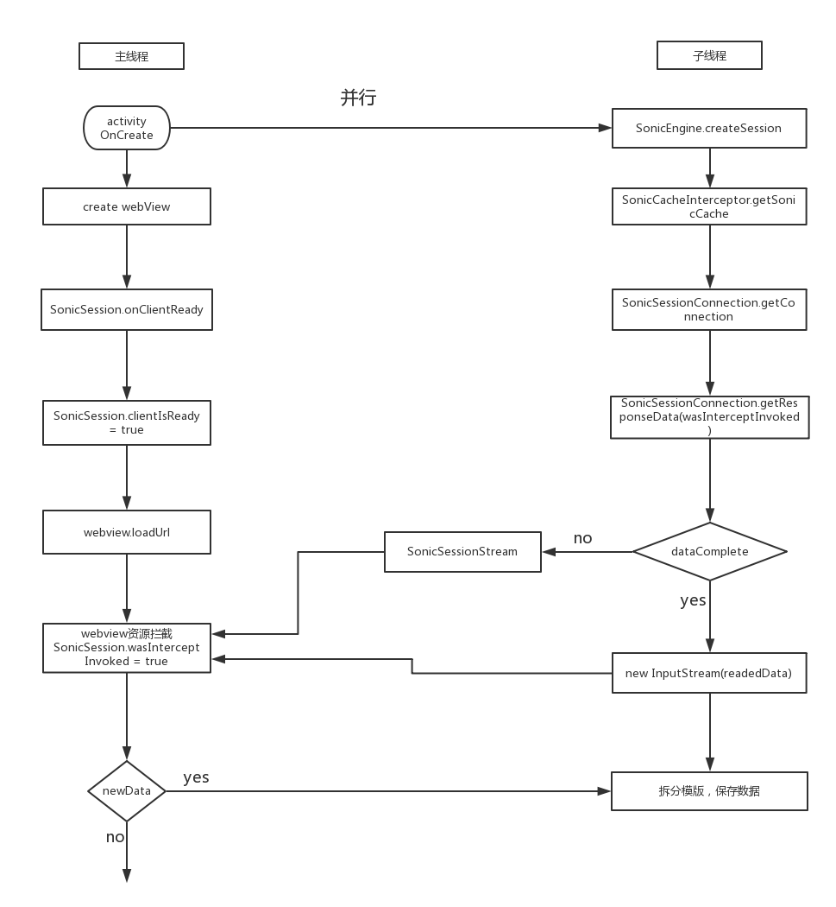
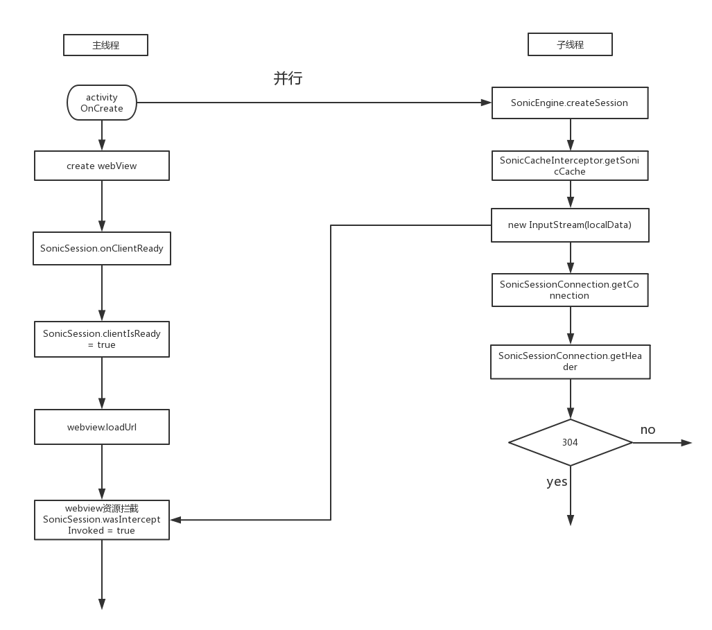
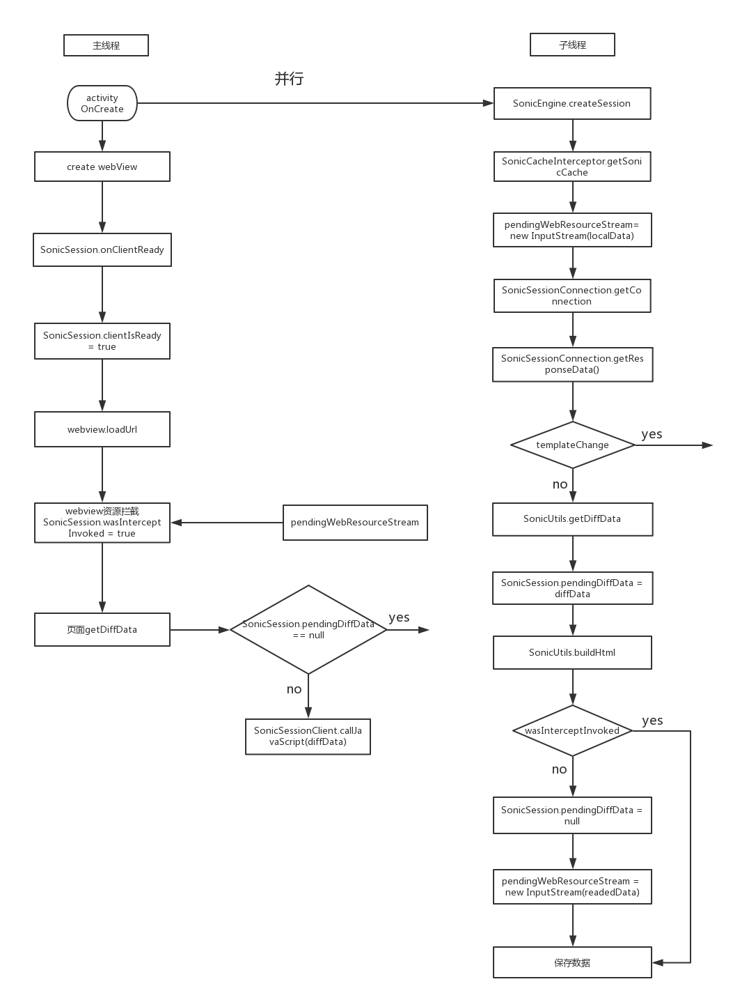
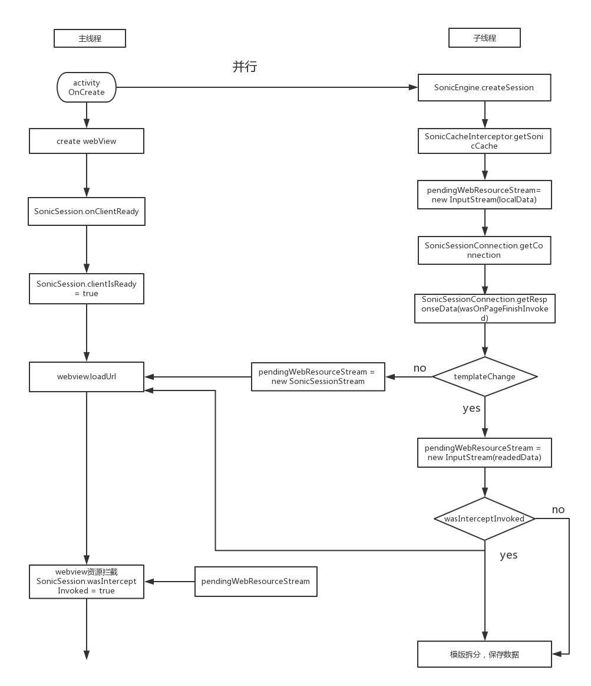

#Sonic Standard模式实现原理
---
从前面介绍的sonic的基本原理可以知道，sonic分为Quick模式和Standard模式。本文介绍Standard模式的基本实现原理。
根据本地缓存的数据情况可以将Quick模式下的sonic分为无缓存和有缓存模式。对于有缓存模式又可以分为完全缓存、局部刷新和全局刷新（也就是模版变更），下面就看下这几种模式的执行流程。
无论是哪种执行模式，核心的思想都是并行，即充分利用webview初始化的时间进行一些数据的处理(webview的初始化耗时还是挺多的)。在包含webview的activity启动时会一边进行webview的初始化逻辑，一边并行的执行sonic的逻辑。
##一，无缓存模式
无缓存模式下的核心思想就是在webview初始化之前建立自己的网络连接，利用webview初始化的时间尽可能多的读取网络的数据，在webview需要数据的时候将自己从网络读取的数据交给webview处理。
代码执行流程为：

这里主要有两条并行线，左边是webview的执行流程，右边是sonic的执行流程。Webview的执行流程比较简单，主要是进行webview的初始话，以及在初始化完之后调用SonicSession（这里的SonicSession对象是activity onCreate的时候通过SonicEngine创建的）的onClientReady方法，告知其webview已经init完毕，之后就开始调webview的laodUrl方法，等待webview资源拦截的回调。剩下的事情交给sonic那边处理。

右边表示sonic的执行流程。首先调用SonicEngine.createSession创建SonicSession对象，接着调用SonicCacheIterceptor的getSonicCache方法来获取要加载的url对应的本地数据，由于是首次加载，所以这里的cache数据是为空的。之后会通过SonicSessionConnection建立一个URLConnection，接着通过这个连接获取服务器返回的数据。由于获取网络数据是个耗时的过程，所以在读取网络数据的过程中会不断判断webView是否发起资源拦截请求（通过SonicSession的wasInterceptInvoked来判断），如果webview已经发起资源拦截请求，就中断网络数据的读取，将已经读取的数据和未读取的网络数据拼接成桥接流SonicSessionStream，并将其赋值给SonicSession的pendingWebResourceStream。

因此在webview发起资源拦截时pendingWebResourceStream存在两种可能，一种时网络数据还没完全读完的桥接流，另一种是网络数据已经完全读完的数据流。如果是桥接流的话在webview渲染完成关闭桥接流的时候会进行模版分割，数据保存等操作。如果是已读完的数据流的话就会在将pendingWebResourceStream数据给内核之后继续在子线程中执行模版分割，数据保存等操作。

##二，有缓存模式：
有缓存模式的核心思想也是在webview初始化之前先读取本地的数据，同时建立自己的网络连接，通过网络连接获取服务器最新的数据。在webview需要数据的时候将本地或服务器返回的新的数据交给webview处理。
有缓存模式又可以分为完全缓存、局部刷新、模板变更。下面依次介绍这几种模式。
###1，完全缓存：
所谓完全缓存就是本地的数据跟服务器的数据是完全一样的。
代码执行流程为

左边webview的执行逻辑跟首次基本一致。右边sonic的执行逻辑前面几步跟首次的逻辑也基本一致，不同的地方开始于通过SonicCacheInterceptor获取的本地cacahe数据是不为空的，会将本地的数据包装为一个InputStream，在webview发起资源拦截的时候将这个InputStream交给内核渲染。同时通过SonicSessionConnection向服务器请求最新数据，由于服务器返回304，没有数据更新，整个sonic的流程执行完毕。
###2，局部刷新：
局部刷新就是本地的数据跟服务器的数据相比，只有data部分有变化，模板跟服务器一样。
代码执行流程为：

左边webview的流程跟前面介绍的基本一样，不一样的地方后面会讲。右边sonic的逻辑前面几步跟完全缓存的时候一样，会先讲本地的数据包装成一个InputStream赋值给SonicSession 的pendingWebResourceStream，接着通过SonicSessionConnection获取服务器的回包数据。这种模式下服务器的回包数据是html的data部分的内容。将这个data跟本地的data做diff，就会得到页面刷新需要的diffData，有了这个diffData之后会将它保存在SonicSession的pendingDiffData变量中。接着通过SonicUtils的buildHtml将服务器返回的data跟本地的模版数据拼接成新的html内容。有了新的html内容之后判断webview的资源拦截是否有发起（通过SonicSession的wasInterceptInvoked来判断），如果有发起的话就将新的html内容保存在本地，然后流程执行完毕。如果这是webview还没有发起资源拦截的话就会将pendingDiffData置空，同时将新的html包装成一个InputStream赋值给pendingWebResourceStream，然后执行最后的数据保存等操作。

通过上面的介绍可以知道在数据更新模式下，webview发起资源拦截的时候有可能得到两种值，一种是之前本地数据组成的输入流，在这种情况下页面调用js获取diffData的时候会将保存的diffData给到页面，让页面执行刷新操作；另一种是由服务器返回的data跟本地模版组成的最新的html包装成的输入流，这种情况下页面展示的就是最新的数据，在获取diffData的时候就不会有返回值了。
###3，模版变更
模板变更是本地的数据跟服务器数据相比，本地的模板跟服务器的模板不一样。
代码执行流程为：

左边webview的逻辑跟首次差不多，不一样的地方后面再讲。右边sonic的逻辑前面几个跟数据更新基本一致，不一样的地方开始于服务器的回包数据不同。在模版更新模式下服务器会返回最新的完整的html内容，由于读取网络数据耗时比较长，为了可以让页面更快的刷新，在读取网络数据的时候会不断判断之前load的本地缓存的数据的页面有没有finish（通过SonicSession的wasOnPageFinishInvoked来判断，这个值会在SonicSessionClient在webview onpagefinish的时候设置），如果wasOnPageFinishInvoked为true就不再读取网络数据了，而是将已读的数据和未读的数据组成桥接流SonicSessionStream，然后在主线程中发起loadUrl。同时在webview资源拦截的时候将刚才建立的桥接流交给内核渲染。

如果整个网络数据读取过程wasOnPageFinishInvoked都没有被设置为true的话sonic就会将读取完的最新的数据包装成一个输入流放在pendingWebResourceStream里。接下来判断wevbiew是否有发起资源拦截。如果没有的话就执行最后的保存数据操作，因为这时已经将pendingWebResourceStream更新为最新的数据了，当webview发起资源拦截的时候sonic给到内核的就是最新的数据了；如果此时webview的资源拦截已经发起了，就是说webview已经加载过之前本地的数据了，那么这时候sonic会主动再调一次webview的loadUrl方法进行刷新页面，等到webview第二次发起资源拦截请求的时候再把最新的数据给到内核去渲染，这种情况sonic在发起webview的loadUrl之后就会继续在子线程执行文件保存等收尾的工作。

这里解释下为什么在模版更新的时候需要判读之前load的本地页面是否有pagefinish。假设本地的页面已经展示完了，而sonic这边还在读取网络的数据，如果没有这个逻辑的话就会等sonic这边读完网络数据之后才能刷新页面；而有了这个逻辑之后就可以在pageFinish的时候直接发起loadUrl，利用webview边下载边解析的功能减少内核的等待时间，从而减少整个页面刷新的耗时。
以上就是sonic在Standard模式下的的大概流程
	