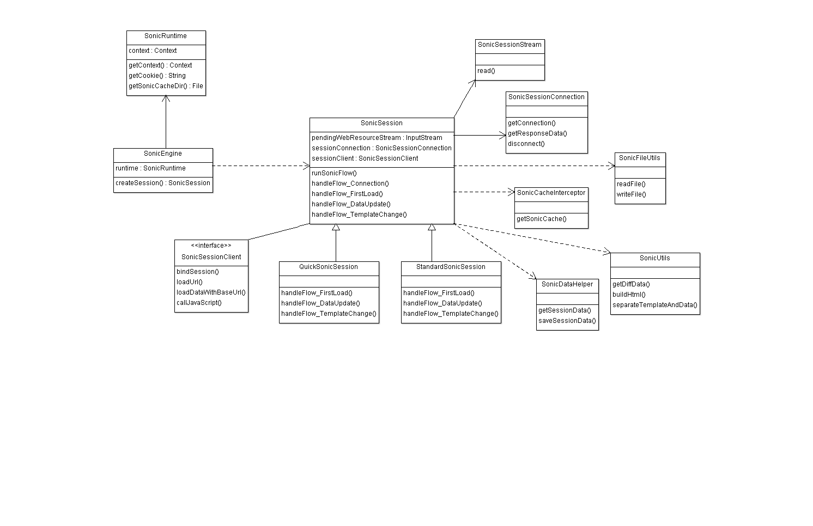

# Sonic框架介绍

---
本文主要介绍sonic的整个框架设置，包括这个框架的类图结构以及各个类的主要职责介绍。
	
sonicSdk类图结构：

sonic类职责说明：

SonicSession：负责sonic的核心逻辑：包括缓存数据的获取，服务器回包数据的处理，页面展示数据的生成以及数据模版的拆分、拼接等。

QuickSonicSession：SonicSession的子类，这种类型的session会使用webview的loadData方式来加载页面。这种方式加载速度比较快，但是由于不能带header（例如csp等），可能会有一些安全问题。

StandardSonicSession：SonicSession的子类，这种类型的session只是通过loadUrl，并且在资源拦截的时候返回数据。这种类型相比于QuickSonicSession速度上可能会慢一些（因为资源拦截需要内核底层派发，再到终端进行拦截）。但是这种方式支持在数据返回的时候添加header，所以不存在安全问题。

SonicEngine：sonic引擎初始化，主要初始化sonic运行需要的runtime和context等信息。

SonicRuntime：提供sonic运行环境需要的一些数据，比如context，文件的保存路径，页面的cookie等信息。

SonicSessionClient：提供sonic与webview交互需要的功能，例如loadUrl，loadDataWithBaseUrl等

SonicCacheInterceptor：sonic缓存数据的提供者，第三方可以提供自定义的缓存内容，也可以使用sonic默认提供的缓存数据。

SonicSessionConnection：sonic底层连接的提供者，通过SonicSessionConnection去获取服务器的回包数据。

SonicSessionStream：为sonic提供数据流，SonicSessionStream会将已读取的网络数据和未读取的网络数据组合成一个桥接流，将这个桥接的数据提供给webview内核进行渲染。利用webview流式加载功能减少耗时。

SonicUtils：sonic工具类，主要负责sonic数据的模版分割，数据重组，diffdata计算等

SonicFileUtils：sonic文件操作工具类，主要负责文件的读写

SonicDataHelper：sonic数据帮助类，主要负责管理sonic除去文件内容之外的其它数据，比如html的md5值，模版的tag等等。

