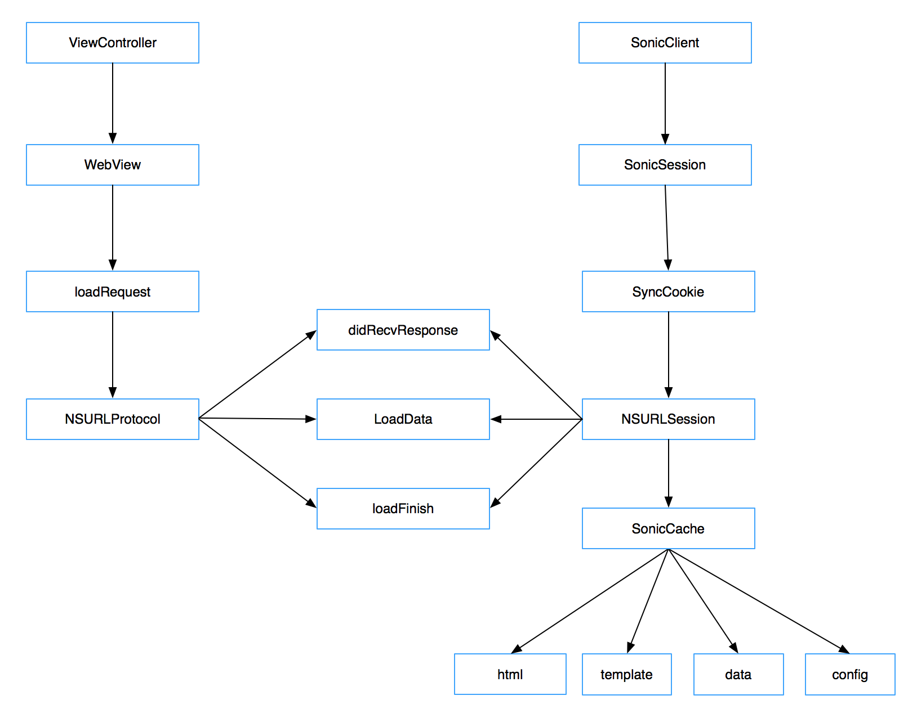
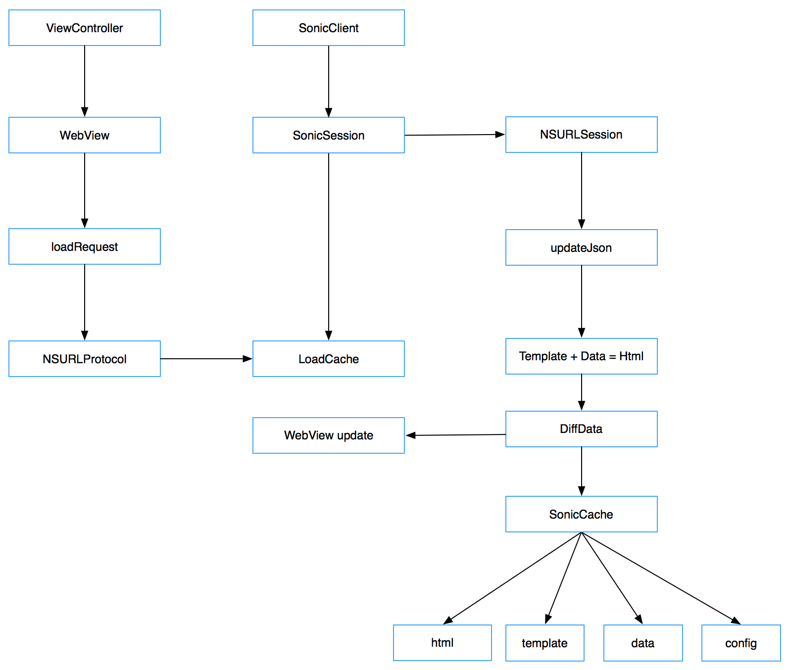
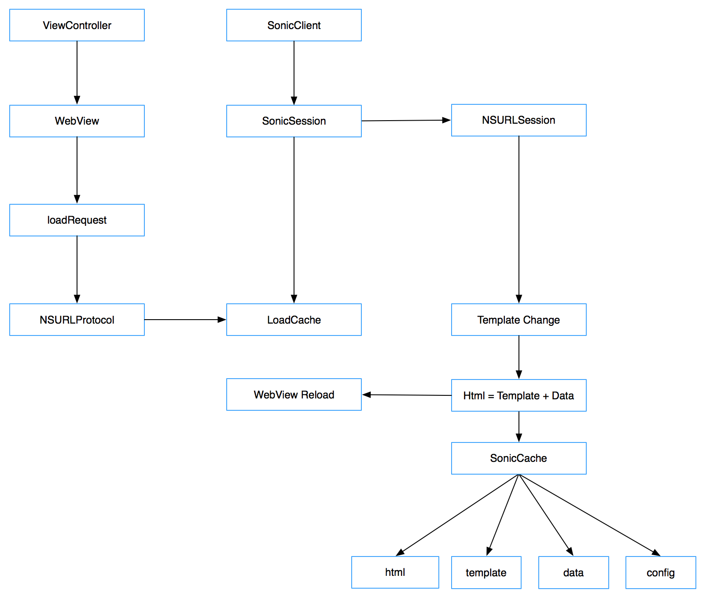
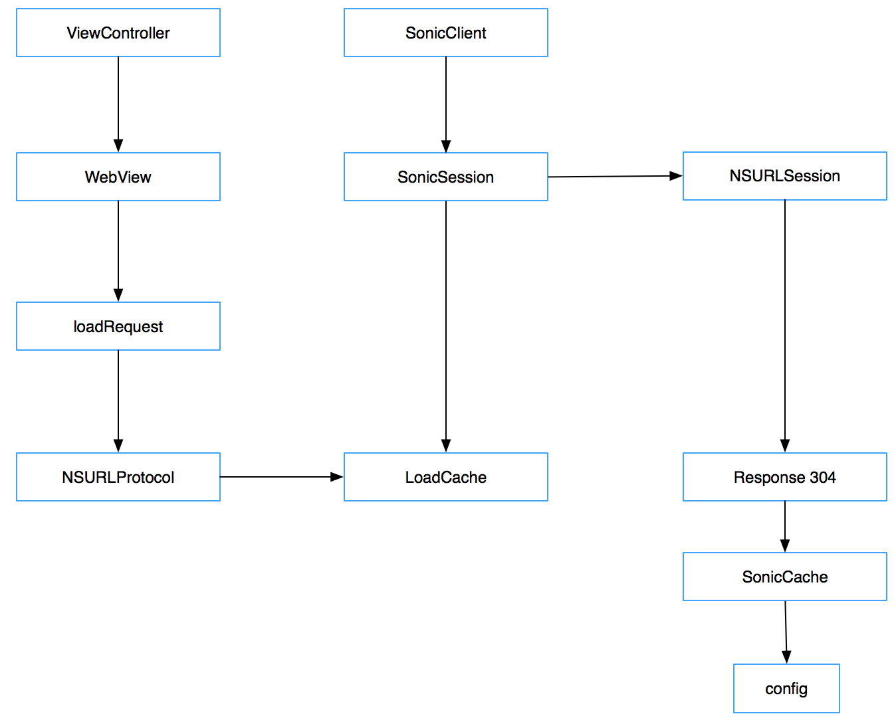

# sonic iOS端实现原理

## Sonic主要实现思路
     基于后端渲染直出的页面拆分成(模版)＋(数据)＝(网页)的模式，在不同场景下，针对(模版)和(数据)分别做更新；
     
## 主要功能模块构成

### 1.SonicSession

    单个页面主资源加载所使用的会话，负责当次链接的完整状态流程。会在创建的sonic线程完成网络的加载。

### 2.SonicClient

    负责管理所有的Session,通过传入Url，创建对应的session
    
### 3.SonicURLProtocol

    负责拦截WebView产生的主资源请求，将SonicSession发起的网络流桥接给WebKit
    
### 4.SonicCache
  
    负责为SonicSession提供缓存处理和缓存的返回，建立内存的缓存，会在这里做模板的更新与拆分。
    
### 5.SonicConnection

    可以继承此基类，提供针对特定的URL完成所需的资源加载，比如离线资源，可以通过这个方式加载到WebKit。
    
## 四大模式场景

### 1.首次加载
     在首次加载页面的时候在未创建UIWebView之前建立起网络链接，等待UIWebView发起主资源请求到NSURLProtocol层完成拦截，并且将提前发起的数据流通过NSURLProtocol返回给WebKit,实现网络提前的并行加载；在网络流完成结束后，对网页数据进行正则匹配，拆分成模板和数据分别保存，保存成功后保存完整的html网页;

### 2.局部刷新
     有网页缓存情况下，二次进入打开页面前先载入完整的html页面缓存，并且在sonic线程发起请求获取可变的数据部分；在网络回包响应中通过template-change字段判定未发生模板更新，通过与上一次保存的（数据）部分与当次更新的（数据）部分进行对比更新；完成后与（模板）部分进行合并，拼接成新的html网页进行缓存；同时将数据的差异部分通过js回调传递给页面进行局部刷新；

### 3.模版更新
	有网页缓存情况下，二次进入打开页面前先载入完整的html页面缓存，并且在sonic线程发起请求获取可变的数据部分；在网络回包响应中通过template-change字段判定发生模板更新，这里旧的模板和数据已经无法使用，模板更新返回的是一个全新全量的html网页，对网页按照首次加载的模式进行处理，对网页数据进行正则匹配，拆分成模板和数据分别保存，保存成功后保存完整的html网页，然后通过session的回调让UIWebView重新发起一次请求，以便在NSURLProtocol层将新的网页数据返回给UIWebView展示出来；

### 4.完全缓存

    有网页缓存的情况下，二次进入打开页面前先载入完整的html页面缓存，收到页面响应为304，终端不需要任何动作，更新一下本次操作的响应时间参数。

